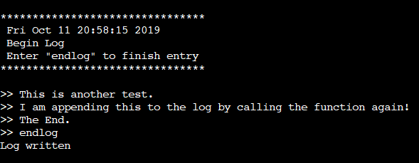
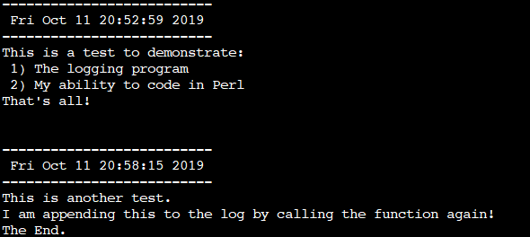

# Logger
## Purpose
Allows user to create and add notes to a log file directly in the command line.
## Use
This program is designed to be run in a Linux environment. The user calls the program and specifies a command argument corresponding the the file that is the be written to. If the file does not exist, the program creates a new one with that name.
### Steps
* Enter the command: perl logger.pl name_of_log_file
* Write what should go in the new log file entry
* When finished, press ENTER, type "endlog", and press ENTER again
### Example
Command Line:

Log File:

## Notes
Perl must be installed on your machine for the program to run.
